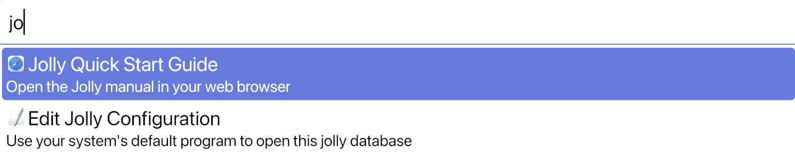

#  Jolly 
Jolly is a small bookmarking launcher for desktop usage.

It extends the concept of your browser bookmarking interface, but
allows these bookmarks to access files on your local file system, as
well as run commands in your shell.

https://user-images.githubusercontent.com/1356587/209451235-6911e5f1-fb4d-4348-903b-ea75bcbff0ca.mp4

# Installation

The latest release of Jolly can be found on github [here](https://github.com/apgoetz/jolly/releases/latest)

Alternatively, for rust users, Jolly can be installed via cargo:

```bash
cargo install jolly
```

## Freedesktop based systems

If you want to use Jolly on Linux and BSD based platforms, then icon
support is based on freedesktop.org standards. This means that you
will need the following packages installed:

+ xdg-utils
+ shared-mime-info

In addition, at least one icon theme needs to be installed. The
default icon theme can be customized at build time using the
environment variable `JOLLY_DEFAULT_THEME`, or it can be configured at
runtime in the config file.  See [icon
documentation](docs/config#icon) for more details.

## NetBSD

On NetBSD, a pre-compiled binary is available from the official
repositories.  To install Jolly, simply run:

```bash
pkgin install jolly
```

Or, if you prefer to build it from source:

```bash
cd /usr/pkgsrc/x11/jolly
make install
```

**Regarding Minimum Supported Rust Version**: Jolly
uses [iced](https://github.com/iced-rs/iced) for its GUI implementation, which
is a fast moving project that generally only targets the latest stable
rustc. Therefore Jolly will also usually target the same MSRV as
`iced`. (Currently 1.65.0)

# Quick Introduction

To use Jolly, simply run the `jolly` executable. Jolly will look for a
suitable [configuration file](docs/file-format.md#locations) `jolly.toml`. 

By default, Jolly won't show any results: just tell you how many entries it has loaded:


You can search for an entry by typing in text: Jolly will use the
title of the entry and any [tags](docs/file-format.md#tags) associated
with the entry to find results:



To open the entry, you can select it using the arrow and enter keys,
or click it with the mouse.

To learn more about the file format used by Jolly, see the [file-format](docs/file-format.md) page.

To learn more about changing settings for Jolly, including how to
customize the theme, see the [config](config.md) page.

To learn more advanced tips and tricks, see the [advanced](docs/advanced.md) usage page.

# Why was this created
There are a lot of really good full featured launcher programs out
there, for example, consider [launchy](https://www.launchy.net/),
[rofi](https://github.com/davatorium/rofi),
or [alfred](https://www.alfredapp.com/). These launcher programs tended
to be packed with features, allowing you to do tons of different
actions: for example, accessing any installed program or searching for
any document on your computer. This can be quite powerful, but it can
be overwhelming to see all the choices. 

On the other end of the spectrum are notetaking applications, such as
[onenote](https://www.onenote.com), [obsidian](https://obsidian.md/),
or [org mode](https://orgmode.org/). These are also super powerful,
and solve the "noise" problem that launchers have, by only including
content that is curated by the user. However, they are focused on the
usecase of storing knowledge, not on quickly launching apps and links,
which means it can take a couple of click to open a bookmark, instead
of the nearly instantaneous feedback of a launcher app.

The other obvious option here would be your web browser. And lets be
honest, your web browser's search bar and bookmark interface has
thousands more hours of development time poured into it:
Jolly can't possibly hope to compete. However, web browsers are
focused on web content only, which means that local files and external
programs are annoyingly sandboxed away, hard to use with the bookmark
interface. 

Hence Jolly: the curation of notetaking apps, with the instantaneous
gratification of an app launcher, and sharp edges exposed that your
web browser doesn't want you to have.
